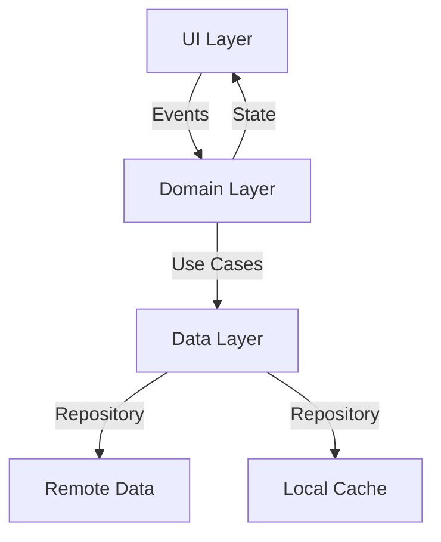
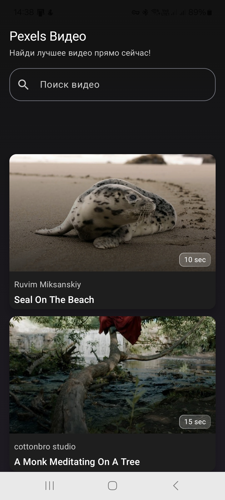
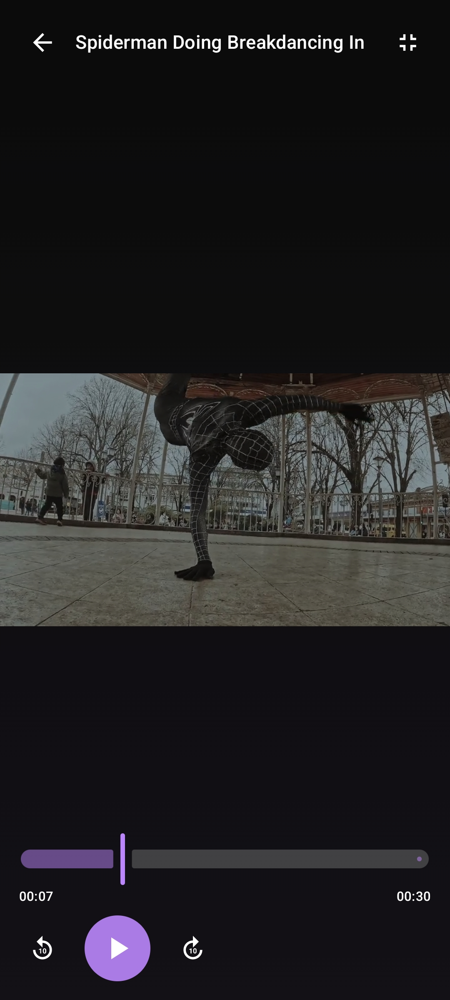
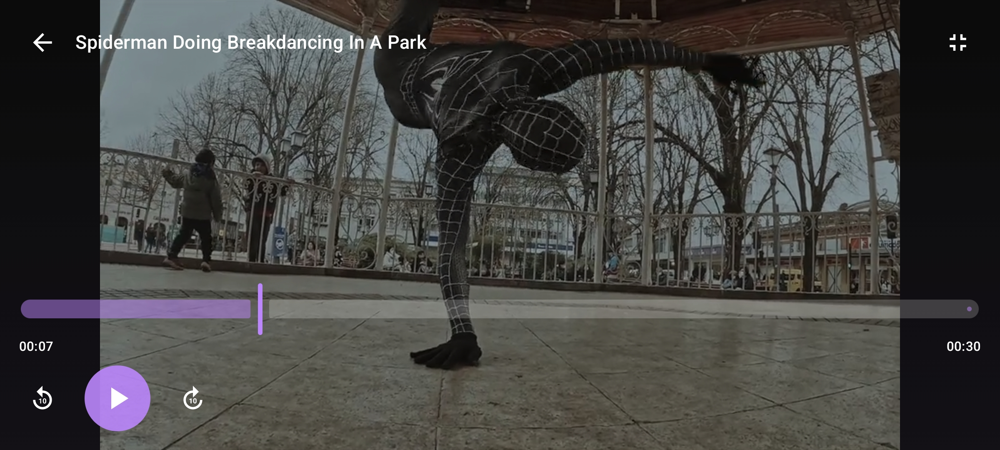

# Pexels Video App 🎥📸

Приложение для просмотра популярных видео и фотографий с Pexels API с современным интерфейсом и продвинутым управлением медиа-контентом.

## ✨ Особенности

- **MVI + Clean Architecture** - Четкое разделение слоёв приложения
- **Jetpack Compose UI** - Современный декларативный UI с Material 3
- **Адаптивный лейаут** - Гибкое отображение контента (горизонтальные/вертикальные списки)
- **Экосистема Media3** - Продвинутое воспроизведение видео с ExoPlayer
- **Оффлайн-режим** - Кэширование данных через Room и SQLite
- **Умное управление**:
  - Поддержка жестов для управления видео
  - Адаптация под ориентацию экрана
  - Продвинутая буферизация

## 🛠 Технологии

**Ядро:**
- Kotlin 2.0.0 + Coroutines + Flow
- Koin (DI)
- Ktor (Сетевой слой)
- Room 2.7 (Локальное хранилище)

**UI:**
- Jetpack Compose
- Material 3 + Adaptive Layouts
- Coil 2.4 (Загрузка изображений)
- Compose Navigation

**Медиа:**
- ExoPlayer (Кастомная реализация)
- Media3 API

## 🏗 Архитектура

## 📱 Скриншоты

| Главный экран | Видеоплеер | Адаптивный UI |
|----------------|-------------|----------------|
|  |  |  |

Больше изображений в папке assets

## ⚙️ Требования

- Android 8.0+ (API 26+)
- JDK 17
- Android Studio Giraffe+
 
